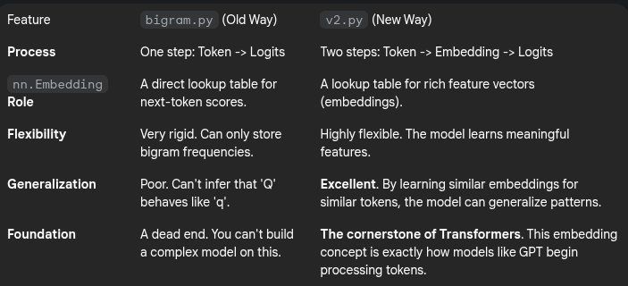

## We make couple of changes to `bigram.py` to get `v2.py`. This acts as a conceptual leap from a simple statistical model to a true neural network that can learn relationships.

The core reason for this change is to **decouple the representation of a token from the prediction of the next token**. This introduces an **intermediate "thinking space"** for the model, which is fundamental to how modern language models work.

### **What bigram.py Was Actually Doing (The Limitation)**
In the first version, the model had this line:

```python
self.token_embedding_table = nn.Embedding(vocab_size, vocab_size)
```

When you feed it a token index, it directly looks up a row in this table. That row contains `vocab_size` numbers, and these numbers are interpreted directly as the logits (raw scores) for the next token.

- **Think of it as a giant lookup table:** For the input character 't', the model would go to the row for 't' and read off the scores for every possible next character ('a', 'b', 'c', ...).

- **The Limitation:** The model has no concept of similarity. It learns the probability of 'h' following 't' completely independently from learning the probability of, say, 'r' following 't'. The character 't' has no identity other than the list of next-character probabilities associated with it. It cannot learn that vowels behave similarly, or that 'T' is just the capitalized version of 't'.

---

### **How `v2.py` solves this: The two-step process**

The new version introduces an intermediate layer of representation, which is a much more powerful and flexible approach.

It splits the process into two distinct steps:

1) **Get a Rich Representation (Token Embedding + Positional Embedding)**

2) **Predict from that Representation (Linear Head)**

Here's the new code that accomplishes this:

```Python
    def __init__(self):
        super().__init__()
        # each token directly reads off the logits for the next token from a lookup table
        self.token_embedding_table = nn.Embedding(vocab_size, n_embd) # n_embd = number of embedding dimensions -> we introduce this to have an intermidiate representation of the input tokens before projecting them to the output vocabulary space
        self.lm_head = nn.Linear(n_embd, vocab_size) # language model head -> projects the n_embd dimensional embeddings to the vocab_size dimensional logits for each token
        self.positional_embedding_table = nn.Embedding(block_size, n_embd) # positional embeddings -> we add this to give the model a sense of order of the tokens in the sequence

    def forward(self, idx, targets=None):

        # idx and targets are both (B,T) tensor of integers
        tok_embd = self.token_embedding_table(idx) # (B,T,C)
        pos_embd = self.positional_embedding_table(torch.arange(0, block_size, device=device)) # (T,C)
        x = tok_embd + pos_embd # (B,T,C) -> we add
        logits = self.lm_head(x) # (B,T,vocab_size)

        if targets is None:
            loss = None
        else:
            B, T, C = logits.shape
            logits = logits.view(B*T, C)
            targets = targets.view(B*T)
            loss = F.cross_entropy(logits, targets)

        return logits, loss
```

#### **Step 1: Token Embedding (tok_embd)**
The `token_embedding_table` no longer maps a token directly to its next-token logits. Instead, it maps each token to a vector of size `n_embd` (e.g., 32). This vector is the token embedding.

This embedding isn't a prediction; it's a **dense feature representation** of the token. During training, the model learns to pack meaning into this vector. For example, it might learn to use:

- One dimension of the vector to represent "is this a vowel?"

- Another dimension for "is this punctuation?"

- Another for "is this an uppercase letter?"

Now, the embeddings for 'a', 'e', 'i', 'o', 'u' will end up being similar to each other in this n_embd-dimensional space because the model learns they behave similarly in the text. 

Will look at Embedding Token later

#### **Step 2 a: The Language Model Head (lm_head)**
The `lm_head` is a standard linear layer. Its job is to take the rich feature vector (`tok_embd`) as input and project it into the prediction space. It looks at the 32 features representing the current token and uses those to calculate the logits for the next token across the entire `vocab_size`.



In short, the change introduces an embedding dimension (`n_embd`) to create a compressed, meaningful representation of the input tokens. This is a far more efficient and powerful way for the model to learn and generalize the underlying patterns of the language.

#### **Step 2 b: Adding Positional Embeddings 📍**
Now that the model knows what each token is, we need to tell it where each token is in the sequence.

##### **The Problem: The Model is a "Bag of Words"**
In the `v2.py` version, the `lm_head` looks at the embedding for each token independently. It has no information about the order of the tokens. To the model, the sequence **"king is a man"** and **"a man is king"** would look like an identical collection of token embeddings. This is a problem because order is crucial for meaning in language.

**The Solution: Encoding Position**
We solve this by creating another embedding table specifically for the positions of the tokens and adding this information to our token embeddings.

Here are the code changes:

1. **Creating the Positional Embedding Table**

```Python

# In __init__
self.position_embedding_table = nn.Embedding(block_size, n_embd)
```

- This creates a new lookup table.

- The size is `block_size` because that's the maximum length of a sequence we'll ever see. We need a unique embedding for each possible position (0, 1, 2, ..., `block_size-1`).

- The dimension of each position vector is n_embd, the same as our token embeddings. This is necessary so we can combine them.

2. **Looking up the Positional Embeddings**

```Python

# In forward
B, T, C = tok_embd.shape
pos_embd = self.position_embedding_table(torch.arange(T, device=device)) # (T, n_embd)
```

- `torch.arange(T, device=device)` creates a tensor of positions: `[0, 1, 2, ..., T-1]`.

- We use these numbers as indices to look up the corresponding vectors from `position_embedding_table`.

- The result, `pos_embd`, is a tensor containing the unique learned vector for each position in the sequence.

3. **Combining Token and Positional Information**

```Python
# In forward
x = tok_embd + pos_embd # (B, T, n_embd)
logits = self.lm_head(x)
```

- This is the key step. We simply add the positional embedding `pos_embd` to the token embedding `tok_embd`.

- PyTorch uses broadcasting here. The `pos_embd` tensor of shape `(T, n_embd)` is automatically added to every batch element in t`tok_embd` (shape `(B, T, n_embd)`).

- The resulting tensor, `x`, is a fusion of information. Each vector in `x` now encodes both **what the token is and where it is located in the sequence**.

For example, the final vector for the token 'A' at position 3 is different from the vector for 'A' at position 7, allowing the model to use order when making predictions.

By making this change, we've given the model the two most fundamental pieces of information it needs to understand a sequence: the identity of the tokens and their order. This is a critical step towards building a Transformer.

---

These changes don't directly create self-attention, but they are the **absolutely essential foundation** upon which self-attention is built. Without them, self-attention would have nothing meaningful to work with.

Here’s the step-by-step progression from our current model to self-attention.

---

### Recap: Where We Are Now

Our current model produces a tensor `x` by adding token embeddings and positional embeddings:
`x = token_embedding + positional_embedding`

This gives us a vector for each token in the sequence. Each vector is rich with information about both the **identity** of the token (*what* it is) and its **position** (*where* it is).


---

### The Current Limitation: Tokens in Isolation

Right now, each token's vector is processed independently by the final linear layer (`lm_head`) to predict the next token. The model still doesn't understand context. For example, in the phrase "the cat sat," the vector for "cat" is generated without any information from "the" or "sat."

The tokens are like people standing in a line, aware of their identity and position, but unable to talk to each other.

---

### The Goal: Enabling Token Communication

To make better predictions, a token needs to understand its context. For example, to predict what comes after "the apple," the model needs to know that "apple" is the important word, not "the."

**Self-attention** is the mechanism that allows tokens to look at each other and exchange information. It helps the model figure out which other tokens in the sequence are important for understanding the current token.

---

### The Bridge to Self-Attention: Query, Key, and Value

This is where our position-aware embedding `x` becomes critical. It serves as the raw material for self-attention. For every single token's vector `x`, we generate three new, distinct vectors by passing `x` through three separate linear layers:

1.  **Query (Q):** This vector represents what a token is looking for. It's like the token asking a question: "Given my identity and position, what kind of information do I need from others?"
2.  **Key (K):** This vector represents what a token has to offer. It's like a label on the token that says: "This is the kind of information I contain."
3.  **Value (V):** This vector is the actual information or content the token will provide if another token "pays attention" to it.

Essentially, our initial embedding `x` is the starting point, and from it, each token gets a specialized role for the upcoming interaction.
`x -> Linear Layer -> Query`
`x -> Linear Layer -> Key`
`x -> Linear Layer -> Value`

---

### How Self-Attention Works (The Interaction)

Once we have the Q, K, and V vectors for every token, the communication happens in three steps:

1.  **Calculate Scores:** To figure out how much attention it should pay to others, a token takes its **Query** vector and computes a dot product with the **Key** vector of every other token in the sequence. This score represents relevance—a high score means "you are very important to me."
    
    
    
2.  **Normalize Scores (Softmax):** These relevance scores are then passed through a softmax function, which turns them into weights that sum to 1. These are the **attention weights**. A token might end up with weights like: `[0.1 for 'the', 0.8 for 'cat', 0.1 for 'sat']`, meaning it's paying the most attention to "cat."
    
3.  **Create a New Representation:** Finally, the model calculates a weighted sum of all the **Value** vectors, using the attention weights. The result is a new, context-aware vector for our token. This new vector is a blend of its own information and the information from the other tokens it paid attention to.

In summary, the token and positional embeddings create the rich, position-aware vectors. **Self-attention is the process that takes these isolated vectors, generates Query, Key, and Value roles, and allows them to interact to build a deep, contextual understanding of the sequence.**